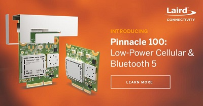

[](https://www.lairdconnect.com/)
# Laird Connectivity Pinnacle 100 Sample Applications
[](https://www.lairdconnect.com/wireless-modules/cellular-solutions/pinnacle-100-cellular-modem) [](https://www.zephyrproject.org/)

This is a collection of Zephyr RTOS based demo applications for the Pinnacle 100 modem. These are intended to demonstrate the functionality of the modem and to act as a starting point for further development.

# Cloning

This is a Zephyr based repository, DO NOT clone this repository directly. Use the west tool to checkout the [manifest repository.](https://github.com/LairdCP/Pinnacle_100_Sample_Applications_Manifest)

# Build

From the directory where you issued the `west init` and `west update` commands you can use the following command to build an app:

## Build `lte_console` app

```
west build -b pinnacle_100_dvk -d Pinnacle_100_Sample_Applications/apps/lte_console/build Pinnacle_100_Sample_Applications/apps/lte_console
```

# Sample Applications

Sample applications can be found in the [apps](apps/) folder.

