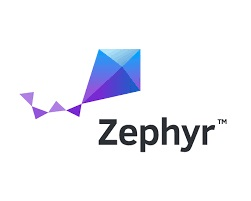

[](https://www.lairdconnect.com/)
# Laird Connectivity Pinnacle 100 Sample Applications
[](https://www.lairdconnect.com/wireless-modules/cellular-solutions/pinnacle-100-cellular-modem) [](https://www.zephyrproject.org/)

This is a collection of Zephyr RTOS based demo applications for the Pinnacle 100 modem. These are intended to demonstrate the functionality of the modem and to act as a starting point for further development.

# Cloning

This is a Zephyr based repository. To clone this repository properly use the `west` tool. To install west you will first need Python3.

Install `west` using `pip3`:

```
# Linux
pip3 install --user -U west

# macOS (Terminal) and Windows (cmd.exe)
pip3 install -U west
```

Once `west` is installed, clone this repository by:

```
west init -m https://github.com/LairdCP/Pinnacle_100_Sample_Applications_Manifest.git
west update
```

# Preparing to Build

If this is your first time working with a Zephyr project on your PC you should follow the [Zephyr getting started guide](https://docs.zephyrproject.org/latest/getting_started/index.html#) to install all the tools.

It is recommended to build this firmware with the [GNU Arm Embedded Toolchain: 8-2019-q3-update](https://developer.arm.com/tools-and-software/open-source-software/developer-tools/gnu-toolchain/gnu-rm/downloads).

# Build

From the directory where you issued the `west init` and `west update` commands you can use the following command to build an app:

## Build `lte_console` app

```
# Windows
west build -b pinnacle_100_dvk -d pinnacle_100_sample_applications\apps\lte_console\build pinnacle_100_sample_applications\apps\lte_console

# Linux and macOS
west build -b pinnacle_100_dvk -d pinnacle_100_sample_applications/apps/lte_console/build pinnacle_100_sample_applications/apps/lte_console
```

# Sample Applications

The following applications are included in this kit.

* [AWS_Connect](apps/aws_connect/README.rst)

* [COAP_DTLS](apps/coap_dtls/README.rst)

* [EDRX_TCP_Server_Reply](apps/edrx_tcp_server_reply/README.rst)

* [HTTP_GET](apps/http_get/README.rst)

* [HTTP_GET_Query](apps/http_get_query/README.rst)

* [HTTP_GET_Query_Check](apps/http_get_query_check/README.rst)

* [Low_Power](apps/low_power/README.rst)

* [LTE_Console](apps/lte_console/README.rst)

* [TCP_Echo_Client](apps/tcp_echo_client/README.rst)

* [UDP_Echo_Client](apps/udp_echo_client/README.rst)

